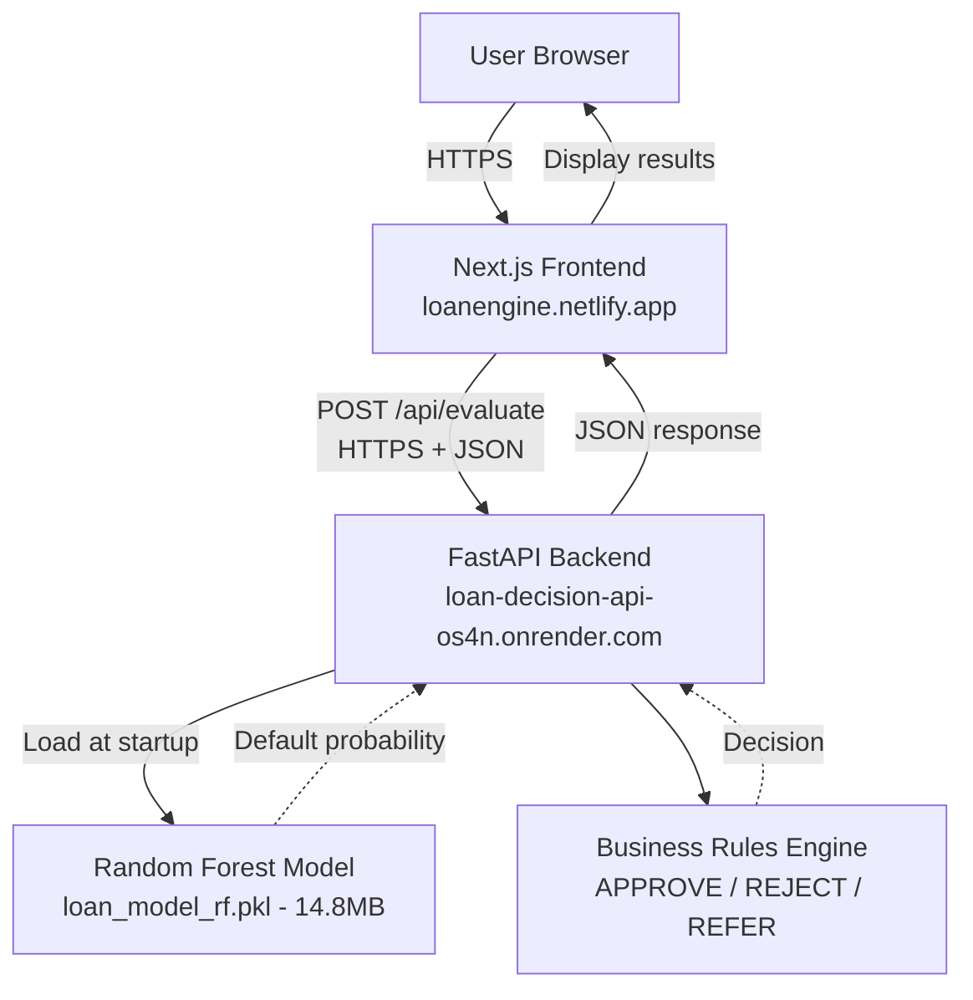
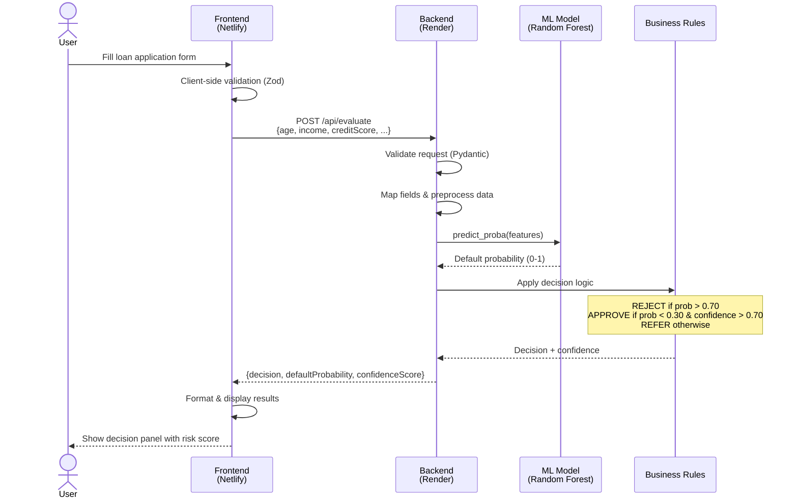

# Loan Engine

AI-powered loan decision system that evaluates loan applications using machine learning. Built for a university project, this application provides real-time loan approval decisions with risk scoring.

## Table of Contents

- [Overview](#overview)
- [Live Deployment](#live-deployment)
- [Architecture](#architecture)
- [Technology Stack](#technology-stack)
- [System Flow](#system-flow)
- [Getting Started](#getting-started)
- [Project Structure](#project-structure)
- [API Reference](#api-reference)
- [Model Information](#model-information)
- [Testing Scenarios](#testing-scenarios)
- [Deployment](#deployment)
- [Cost](#cost)
- [Features](#features)
- [Security Considerations](#security-considerations)
- [Future Enhancements](#future-enhancements)

## Overview

This loan decision system is a full-stack application that combines modern web technologies with machine learning to provide automated loan approval decisions. The system accepts loan application data, processes it through a pre-trained Random Forest model to calculate default probability, applies business rules, and returns a transparent decision with risk scoring.

### Problem Statement

We need a simple loan decision app that accepts applicant data, produces a probability of default with a machine learning model, applies clear business rules, and returns a transparent decision. The app must be easy to run locally and simple to deploy for live demos.

## Live Deployment

**Frontend:** https://loanengine.netlify.app
**Backend API:** https://loan-decision-api-os4n.onrender.com
**Health Check:** https://loan-decision-api-os4n.onrender.com/health

Note: The backend uses Render's free tier, which sleeps after 15 minutes of inactivity. The first request may take approximately 30 seconds to wake up the service.

## Architecture

The system consists of three main components working together:

### Components

**Frontend (Netlify)**
User-facing Next.js web application that collects loan application data through an intuitive form interface and displays decision results with visual risk indicators.

**Backend (Render)**
FastAPI service that validates input, preprocesses data, runs ML predictions, and applies business rules to generate final decisions.

**ML Model (Random Forest)**
Pre-trained classifier with 300 decision trees trained on 45,000 loan applications. The model outputs default probability which is used for risk assessment.

### System Architecture Diagram



### Request Flow Diagram



## Technology Stack

### Frontend

- **Framework:** Next.js 14.2.25 with React 19
- **Language:** TypeScript/JavaScript
- **Styling:** Tailwind CSS with Radix UI components
- **Forms:** React Hook Form with Zod validation
- **HTTP Client:** Native fetch API
- **Hosting:** Netlify (auto-deploy on git push)

### Backend

- **Framework:** FastAPI (high-performance Python web framework)
- **ML Library:** scikit-learn (Random Forest Classifier)
- **Data Processing:** pandas for data manipulation
- **Model Persistence:** joblib for model serialization
- **Server:** uvicorn ASGI server
- **Validation:** Pydantic models for request/response validation
- **Hosting:** Render (auto-deploy on git push)

### Machine Learning

- **Algorithm:** Random Forest Classifier
- **Number of Trees:** 300
- **Max Depth:** 10 (prevents overfitting)
- **Training Data:** 45,000 loan applications
- **Input Features:** 13 raw features
- **Processed Features:** 22 (after one-hot encoding)
- **Model Size:** 14.8 MB
- **Output:** Default probability (0-1 scale) with confidence score

### Deployment

- **Version Control:** GitHub
- **Frontend CI/CD:** Netlify auto-deploy on push to main
- **Backend CI/CD:** Render auto-deploy on push to main
- **Configuration Files:** netlify.toml, render.yaml

## System Flow

### Complete Request Processing

**1. User Access**
- Users visit the web application via the Netlify URL
- Next.js serves the application from Netlify's global CDN
- No authentication required (demo application)

**2. Application Submission**
- User fills the loan application form with 13 required fields
- Client-side validation ensures data quality before submission
- Form data is serialized to JSON and sent via HTTPS POST

**3. Backend Processing**
- FastAPI receives the request at `/api/evaluate`
- Pydantic validates all fields with type checking
- Field mapping converts camelCase (frontend) to snake_case (backend)
- Data preprocessing includes one-hot encoding and feature scaling

**4. ML Prediction**
- Pre-trained Random Forest model (loaded at server startup)
- Input data processed through 300 decision trees
- Model outputs default probability on 0-1 scale
- Confidence score calculated from prediction variance

**5. Business Decision Rules**
- **REJECT:** Default probability > 70%
- **APPROVE:** Default probability < 30% AND confidence > 70%
- **REFER:** Everything else (requires manual review)

**6. Response & Display**
- Backend returns JSON with decision, probability, and confidence
- Frontend displays results in color-coded decision panel
- User sees decision badge, risk percentage, and confidence level

**7. Continuous Deployment**
- Push to GitHub triggers automatic deployments
- Netlify rebuilds frontend (2-3 minutes)
- Render rebuilds backend (2-4 minutes)
- Zero downtime during deployments

## Getting Started

### Quick Test (No Installation Required)

Visit the live application at https://loanengine.netlify.app

Test with different applicant profiles to observe how the ML model evaluates risk:
- High-risk applicants (low income, high loan amount, poor credit)
- Medium-risk applicants (moderate financial indicators)
- Low-risk applicants (high income, low loan amount, excellent credit)

### Local Development Setup

**Prerequisites:**
- Python 3.8 or higher
- Node.js 18 or higher
- Git

**Backend Setup:**

```bash
# Navigate to backend directory
cd backend

# Install Python dependencies
pip install -r requirements.txt

# Start the FastAPI server
python main.py

# Backend runs on http://localhost:8000
# Health check: http://localhost:8000/health
```

**Frontend Setup (in a new terminal):**

```bash
# Navigate to frontend directory
cd front-end

# Install Node.js dependencies
npm install

# Create environment configuration
# Copy .env.example to .env.local and configure:
# NEXT_PUBLIC_API_URL=http://localhost:8000

# Start the development server
npm run dev

# Frontend runs on http://localhost:3000
```

**Verify Installation:**

```bash
# Test backend health
curl http://localhost:8000/health

# Test loan evaluation with sample data
curl -X POST http://localhost:8000/api/evaluate \
  -H "Content-Type: application/json" \
  -d @backend/test_request.json
```

## Project Structure

```
loan_engine/
├── backend/                      # Python FastAPI backend
│   ├── main.py                   # FastAPI application & endpoints
│   ├── requirements.txt          # Python dependencies
│   ├── test_request.json         # Sample test data
│   ├── tests/                    # Backend test suite
│   │   ├── test_api.py          # API endpoint tests
│   │   ├── test_business_rules.py
│   │   ├── test_field_mapping.py
│   │   ├── test_preprocessing.py
│   │   └── test_pydantic_models.py
│   └── model/                    # ML model directory
│       ├── train.py              # Model training script
│       ├── predict.py            # Standalone prediction script
│       ├── data/
│       │   └── loan_data.csv     # Training dataset (45K rows)
│       └── trained/
│           ├── loan_model_rf.pkl        # Trained Random Forest (14.8MB)
│           ├── model_columns_rf.pkl     # Feature column names
│           └── scaler_rf.pkl            # StandardScaler for preprocessing
│
├── front-end/                    # Next.js React frontend
│   ├── app/
│   │   ├── layout.jsx            # Root layout component
│   │   └── page.jsx              # Main application page
│   ├── components/
│   │   ├── loan-decision-system.jsx    # Main orchestrator component
│   │   ├── applicant-form.jsx          # Loan application form
│   │   ├── decision-panel.jsx          # Results display component
│   │   └── ui/                         # 50+ reusable UI components
│   ├── hooks/                    # Custom React hooks
│   ├── lib/                      # Utility functions
│   ├── styles/                   # Global styles
│   ├── public/                   # Static assets
│   ├── package.json              # Node.js dependencies
│   ├── next.config.mjs           # Next.js configuration
│   ├── tsconfig.json             # TypeScript configuration
│   └── .env.example              # Environment template
│
├── netlify.toml                  # Netlify deployment configuration
├── render.yaml                   # Render deployment configuration
├── README.md                     # This file
├── NETLIFY_DEPLOY.md            # Netlify deployment guide
└── NETLIFY_FIX.md               # Deployment troubleshooting
```

## API Reference

### Endpoint: POST /api/evaluate

Evaluates a loan application and returns a decision with risk scoring.

**Request Headers:**
```
Content-Type: application/json
```

**Request Body:**
```json
{
  "age": 35,
  "gender": "Female",
  "education": "Bachelor",
  "income": 80000,
  "employmentExperience": 10,
  "homeOwnership": "OWN",
  "loanAmount": 15000,
  "loanIntent": "HOMEIMPROVEMENT",
  "interestRate": 8.5,
  "loanPercentageIncome": 0.19,
  "creditHistoryLength": 12,
  "creditScore": 750,
  "previousLoanDefault": "No"
}
```

**Field Descriptions:**

| Field | Type | Description | Example Values |
|-------|------|-------------|----------------|
| age | integer | Applicant age in years | 18-100 |
| gender | string | Applicant gender | "Male", "Female" |
| education | string | Education level | "High School", "Bachelor", "Master", "Doctorate" |
| income | integer | Annual income in USD | 10000-1000000 |
| employmentExperience | integer | Years of employment | 0-50 |
| homeOwnership | string | Home ownership status | "RENT", "OWN", "MORTGAGE", "OTHER" |
| loanAmount | integer | Requested loan amount in USD | 500-100000 |
| loanIntent | string | Purpose of loan | "PERSONAL", "EDUCATION", "MEDICAL", "VENTURE", "HOMEIMPROVEMENT", "DEBTCONSOLIDATION" |
| interestRate | number | Interest rate percentage | 0.0-30.0 |
| loanPercentageIncome | number | Loan amount / income ratio | 0.0-5.0 |
| creditHistoryLength | integer | Years of credit history | 0-50 |
| creditScore | integer | Credit score | 300-850 |
| previousLoanDefault | string | Previous default history | "Yes", "No" |

**Response:**
```json
{
  "decision": "APPROVE",
  "defaultProbability": 0.23,
  "confidenceScore": 0.54
}
```

**Response Fields:**

| Field | Type | Description |
|-------|------|-------------|
| decision | string | Final decision: "APPROVE", "REJECT", or "REFER" |
| defaultProbability | number | ML model's predicted default probability (0.0-1.0) |
| confidenceScore | number | Model confidence in prediction (0.0-1.0) |

**Decision Logic:**

- **REJECT:** High risk - Default probability > 70%
- **APPROVE:** Low risk - Default probability < 30% AND confidence > 70%
- **REFER:** Medium risk or uncertain - Requires manual review

**Field Mapping (Frontend to Backend):**

The API automatically maps frontend camelCase to backend snake_case:

| Frontend | Backend | Model Feature |
|----------|---------|---------------|
| age | person_age | person_age |
| gender | person_gender | person_gender |
| education | person_education | person_education |
| income | person_income | person_income |
| employmentExperience | person_emp_exp | person_emp_exp |
| homeOwnership | person_home_ownership | person_home_ownership |
| loanAmount | loan_amnt | loan_amnt |
| loanIntent | loan_intent | loan_intent |
| interestRate | loan_int_rate | loan_int_rate |
| loanPercentageIncome | loan_percent_income | loan_percent_income |
| creditHistoryLength | cb_person_cred_hist_length | cb_person_cred_hist_length |
| creditScore | credit_score | credit_score |
| previousLoanDefault | previous_loan_defaults_on_file | previous_loan_defaults_on_file |

### Other Endpoints

**GET /health**

Health check endpoint for monitoring service availability.

**Response:**
```json
{
  "status": "healthy",
  "model_loaded": true,
  "timestamp": "2025-10-28T15:30:00.000Z"
}
```

## Model Information

### Algorithm: Random Forest Classifier

Random Forest is an ensemble learning method that constructs multiple decision trees during training and outputs the class that is the mode of the classes (classification) or mean prediction (regression) of the individual trees.

### Training Details

- **Dataset Size:** 45,000 loan applications
- **Train/Test Split:** 80/20 (stratified)
- **Class Balancing:** Balanced class weights applied
- **Number of Trees:** 300 estimators
- **Max Tree Depth:** 10 (prevents overfitting)
- **Cross-validation:** Stratified k-fold
- **Training Time:** Approximately 5-10 minutes on standard hardware

### Feature Engineering

**Raw Input Features (13):**
1. Person age
2. Person gender
3. Person education
4. Person income
5. Person employment experience
6. Person home ownership
7. Loan amount
8. Loan intent
9. Interest rate
10. Loan percentage of income
11. Credit history length
12. Credit score
13. Previous loan defaults

**Processed Features (22):**
- Numerical features scaled using StandardScaler
- Categorical features one-hot encoded (gender, education, home ownership, loan intent, previous defaults)

### Model Performance

The model is designed for risk assessment rather than perfect prediction. It provides:
- Default probability estimates for each application
- Confidence scores indicating prediction certainty
- Features importance rankings for model interpretability

**Model Artifacts:**
- `loan_model_rf.pkl` - Trained Random Forest classifier (14.8 MB)
- `model_columns_rf.pkl` - Feature column names for alignment
- `scaler_rf.pkl` - StandardScaler for feature preprocessing

### Business Rules Layer

The ML model probability is passed through a business rules engine:

```python
if default_probability > 0.70:
    decision = "REJECT"  # High risk
elif default_probability < 0.30 and confidence_score > 0.70:
    decision = "APPROVE"  # Low risk, high confidence
else:
    decision = "REFER"  # Manual review needed
```

This two-layer approach ensures:
- Automated decisions for clear-cut cases
- Human oversight for edge cases
- Transparent and explainable decision-making

## Testing Scenarios

### Scenario 1: High Risk Applicant (Expected: REJECT)

```json
{
  "age": 24,
  "gender": "Male",
  "education": "High School",
  "income": 10000,
  "employmentExperience": 0,
  "homeOwnership": "RENT",
  "loanAmount": 30000,
  "loanIntent": "PERSONAL",
  "interestRate": 20.0,
  "loanPercentageIncome": 3.0,
  "creditHistoryLength": 1,
  "creditScore": 500,
  "previousLoanDefault": "No"
}
```

**Expected Result:** ~83% default probability → REJECT

**Risk Factors:**
- Very high loan-to-income ratio (3.0)
- Low credit score (500)
- Minimal credit history (1 year)
- No employment experience
- High interest rate (20%)

### Scenario 2: Medium Risk Applicant (Expected: REFER)

```json
{
  "age": 35,
  "gender": "Female",
  "education": "Bachelor",
  "income": 80000,
  "employmentExperience": 10,
  "homeOwnership": "MORTGAGE",
  "loanAmount": 15000,
  "loanIntent": "HOMEIMPROVEMENT",
  "interestRate": 8.5,
  "loanPercentageIncome": 0.19,
  "creditHistoryLength": 12,
  "creditScore": 750,
  "previousLoanDefault": "No"
}
```

**Expected Result:** ~37% default probability → REFER

**Mixed Factors:**
- Good credit score (750)
- Reasonable loan-to-income ratio (0.19)
- Established employment (10 years)
- But: Probability not low enough for auto-approval

### Scenario 3: Low Risk Applicant (Expected: APPROVE)

```json
{
  "age": 40,
  "gender": "Male",
  "education": "Master",
  "income": 120000,
  "employmentExperience": 15,
  "homeOwnership": "OWN",
  "loanAmount": 10000,
  "loanIntent": "DEBTCONSOLIDATION",
  "interestRate": 5.5,
  "loanPercentageIncome": 0.08,
  "creditHistoryLength": 20,
  "creditScore": 820,
  "previousLoanDefault": "No"
}
```

**Expected Result:** ~23% default probability with high confidence → APPROVE

**Positive Factors:**
- Excellent credit score (820)
- Very low loan-to-income ratio (0.08)
- Extensive employment experience (15 years)
- Long credit history (20 years)
- Low interest rate (5.5%)
- Home ownership

## Deployment

### Deploy Your Own Instance

#### Backend Deployment (Render)

1. Fork or clone this repository
2. Create a Render account at https://render.com
3. Connect your GitHub repository
4. Create new Web Service using Blueprint (render.yaml)
5. Render will automatically:
   - Install dependencies
   - Download model files
   - Start the FastAPI server
6. Note your backend URL (e.g., https://your-app.onrender.com)

Deployment time: Approximately 5 minutes

**Configuration (render.yaml):**
```yaml
- type: web
  name: loan-decision-api
  env: python
  buildCommand: cd backend && pip install -r requirements.txt
  startCommand: cd backend && python main.py
```

#### Frontend Deployment (Netlify)

1. Create a Netlify account at https://netlify.com
2. Connect your GitHub repository
3. Configure build settings:
   - Base directory: `front-end`
   - Build command: `npm run build`
   - Publish directory: `front-end/.next`
4. Add environment variable:
   - Key: `NEXT_PUBLIC_API_URL`
   - Value: Your Render backend URL
5. Deploy

Deployment time: Approximately 2-3 minutes

**Configuration (netlify.toml):**
```toml
[build]
  base = "front-end"
  command = "npm install && npm run build"
  publish = ".next"
```

For detailed deployment instructions, see [NETLIFY_DEPLOY.md](NETLIFY_DEPLOY.md)

For troubleshooting deployment issues, see [NETLIFY_FIX.md](NETLIFY_FIX.md)

### Continuous Deployment

Both platforms support automatic deployments:
- Push to main branch → Automatic rebuild and deploy
- Pull request previews available
- Zero downtime deployments
- Automatic HTTPS certificates

## Cost

**Total Monthly Cost: $0**

| Component | Service | Plan | Features | Cost |
|-----------|---------|------|----------|------|
| Frontend | Netlify | Free Tier | 100 GB bandwidth, 300 build minutes/month | $0 |
| Backend | Render | Free Tier | 750 hours/month, sleeps after 15 min inactivity | $0 |
| Domain | Optional | - | Custom domain (optional) | ~$10-15/year |

**Free Tier Limitations:**

**Render:**
- Service sleeps after 15 minutes of inactivity
- First request after sleep takes ~30 seconds to wake
- 750 free hours per month (sufficient for demos)

**Netlify:**
- 100 GB bandwidth per month
- 300 build minutes per month
- More than sufficient for university projects

**Note:** These limitations are acceptable for demonstration and university project purposes. For production use with guaranteed uptime, paid tiers are recommended.

## Features

**Real-time Loan Evaluation**
- Instant decision feedback (typically < 2 seconds)
- ML-powered risk assessment
- Confidence scoring for transparency

**Comprehensive Form Validation**
- Client-side validation (Zod schemas)
- Server-side validation (Pydantic models)
- Clear error messages and field guidance

**Decision Transparency**
- Visual risk indicators
- Confidence scores
- Clear decision rationale

**Modern User Interface**
- Mobile-responsive design
- Accessible components (WCAG compliant)
- Dark/light theme support
- Intuitive form layout

**Developer Experience**
- Comprehensive API documentation
- Type-safe code (TypeScript + Pydantic)
- Automatic deployments
- Health check endpoints

**Testing Support**
- Sample test data included
- Multiple test scenarios documented
- Backend test suite included
- Easy local development setup

## Security Considerations

### Current Implementation

**Input Validation**
- All inputs validated on both client and server
- Type checking with Pydantic models
- Range validation for numerical inputs
- Enum validation for categorical inputs

**CORS Configuration**
- Currently allows all origins (for demo purposes)
- Should be restricted to specific domains in production

**Error Handling**
- Comprehensive error catching and logging
- No sensitive information exposed in error messages
- Graceful degradation for service failures

**Data Privacy**
- No sensitive data stored
- Stateless processing (no database)
- All decisions returned in response only

### Production Recommendations

For production deployment, implement:

**Authentication & Authorization**
- API key authentication
- Rate limiting per user/IP
- OAuth 2.0 for user authentication

**Enhanced Security**
- Restrict CORS to specific domains
- Implement request signing
- Add HTTPS everywhere
- Enable security headers (HSTS, CSP, etc.)

**Compliance**
- Fair lending regulations compliance
- GDPR/privacy law compliance
- Audit trail with permanent storage
- Human review workflow for REFER cases

**Monitoring**
- Request logging and analytics
- Error tracking and alerting
- Performance monitoring
- Model drift detection

## Future Enhancements

### Short-term Improvements

**User Experience**
- Add feature importance visualization
- Export decisions to PDF format
- Add decision history tracking
- Implement save/load application drafts

**Technical Improvements**
- Add comprehensive logging
- Implement rate limiting
- Add API authentication
- Create admin dashboard

### Medium-term Improvements

**Data Management**
- Add database for decision storage
- Implement audit trail
- Create decision review interface
- Add user authentication system

**Model Improvements**
- A/B testing for different models
- Model versioning system
- Feature importance explanations
- Continuous model monitoring

### Long-term Improvements

**Advanced Features**
- Continuous learning pipeline
- Multi-model ensemble predictions
- Integration with credit bureau APIs
- Regulatory compliance automation

**Platform Expansion**
- Native mobile applications
- Batch processing capability
- Analytics dashboard
- Workflow automation

## Development Workflow

### Running Tests

**Backend Tests:**
```bash
cd backend
pytest tests/ -v
```

**Test Coverage:**
```bash
cd backend
pytest --cov=. tests/
```

### Model Training

To retrain the model with new data:

```bash
cd backend/model
python train.py
```

This will:
1. Load training data from `data/loan_data.csv`
2. Perform train/test split
3. Train Random Forest classifier
4. Save model artifacts to `trained/` directory

### Code Quality

**Python (Backend):**
- Follow PEP 8 style guide
- Use type hints
- Document functions with docstrings

**TypeScript/JavaScript (Frontend):**
- Follow Airbnb style guide
- Use TypeScript for type safety
- Document components with JSDoc

## Documentation

- **README.md** - This comprehensive guide
- **NETLIFY_DEPLOY.md** - Detailed Netlify deployment instructions
- **NETLIFY_FIX.md** - Troubleshooting common deployment issues

## License

This is a university project built for educational purposes.

---

**Built with:** Next.js, FastAPI, scikit-learn, Netlify, Render

**Project Type:** University Machine Learning Project

**Status:** Production-ready and deployed

**Live Demo:** https://loanengine.netlify.app
